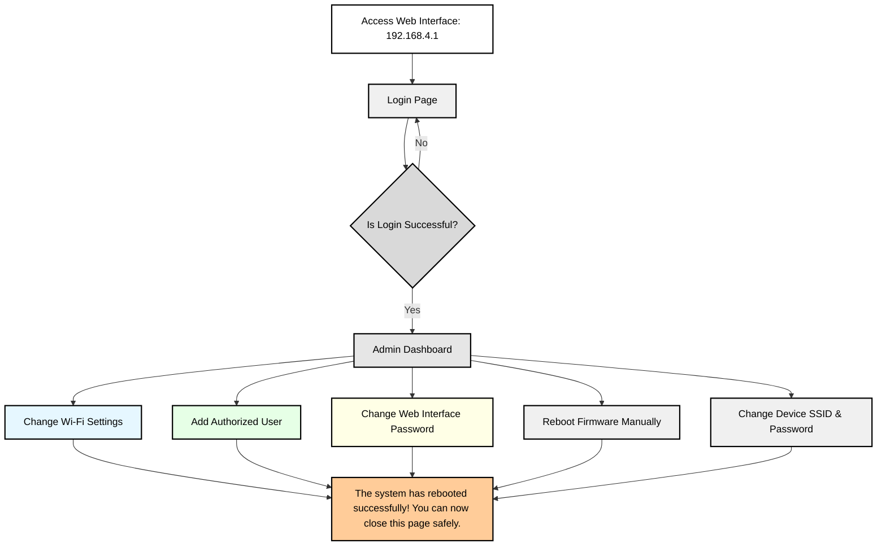
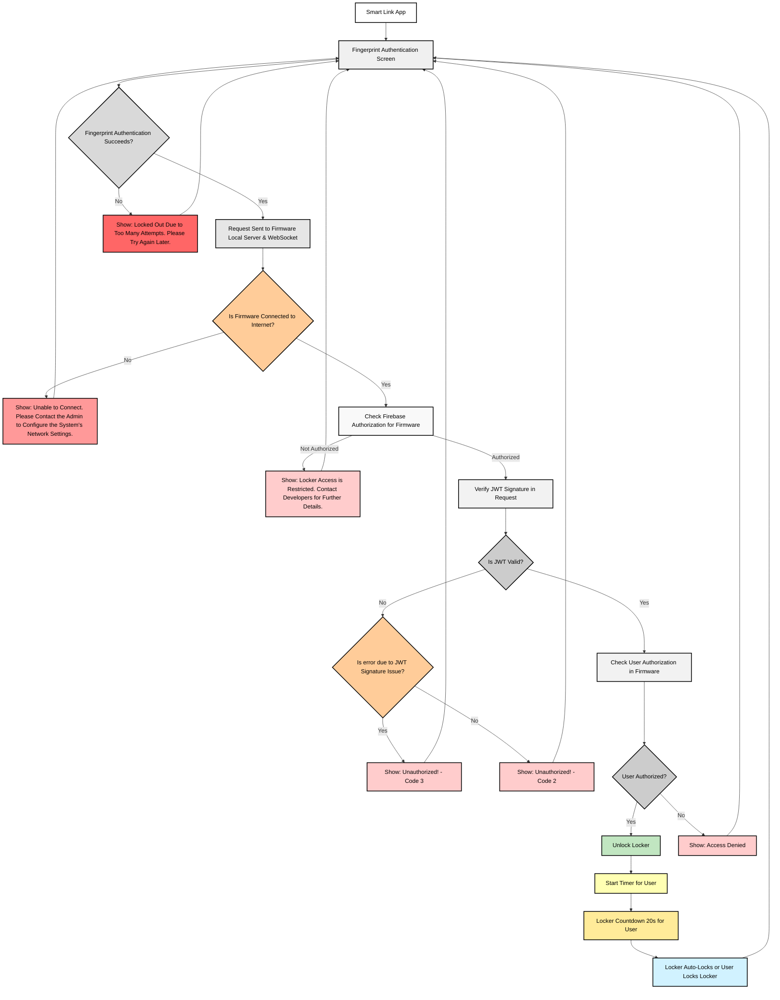

# Multi Smart Safe Locker System

> An ESP32 smart locker system designed for secure and efficient access management. It provides a web interface for configuration, email-based user authorization, and seamless unlocking via the **[Smart Link](https://github.com/mediocre9/smart-link)** mobile app, making it ideal for individuals, organizations, and homeowners.

> [!WARNING]  
> Firmware is under **heavy develpoment** — expect breaking changes across modules.  
> Existing architecture diagrams are outdated and no longer reflect the current system structure.

## Contents

1. [Features](#1-features)
2. [System Responses](#2-system-responses)
3. [System Flow](#3-system-flow)
    - [System Web Interface Flow](#system-web-interface-flow)
    - [Smart Link and Firmware System Flow](#smart-link-and-firmware-system-flow)
4. [Setup](#4-setup)
    - [Firebase Project Setup](#firebase-project-setup)
    - [Firmware Configuration](#firmware-configuration)
    - [Uploading HTML Files](#uploading-html-files)
5. [Usage](#5-usage)
    - [Smart Link Integration](#smart-link-integration)
6. [Admin Panel Web Interface Previews](#6-admin-panel-web-interface-previews)
7. [Libraries](#7-libraries)

## 1. Features

| **Feature**                         | **Description**                                                                                                                                 |
| ----------------------------------- | ----------------------------------------------------------------------------------------------------------------------------------------------- |
| **Remote Setup & Control**          | Seamlessly manage locker settings through the locally hosted ESP32 web interface, providing an easy way to configure the system.                |
| **Wi-Fi Configuration**             | Admins can configure Wi-Fi SSID and password for quick network setup, ensuring smooth connectivity for the device.                              |
| **Secure User Authorization**       | Access is granted by adding the Gmail IDs that users used to sign up on the app, ensuring only authorized individuals can unlock the locker.    |
| **Real-Time Notifications**         | The WebSocket sends real-time timeout notifications to users when the locker is about to auto-lock.                                             |
| **Firmware Revocation**             | Firebase is only used for firmware-level restrictions for developers.                                                                           |
| **Individualized Auto-Lock Timers** | Each locker has a unique 20-second auto-lock timer that ensures security by re-locking the locker after each use.                               |
| **Fingerprint Authentication**      | The app prompts users for fingerprint authentication before submitting their unlock request to the firmware, adding an extra layer of security. |

---

## 2. System Responses

| **Type**                            | **Status Code** | **Message**                                                                               |
| ----------------------------------- | --------------- | ----------------------------------------------------------------------------------------- |
| **Locker Unlocked**                 | 200             | `Locker (GPIO number i.e 14) has been unlocked.`                                          |
| **WebSocket connection exists**     | 409             | `Websocket connection is already established!`                                            |
| **Access Denied**                   | 403             | `Access Denied. Please contact the admin to gain access.`                                 |
| **Firmware Restrictions**           | 403             | `Locker access is restricted. Contact Developers for further details.`                    |
| **Network Connection Issues**       | 403             | `Unable to connect. Please contact the admin to configure the system's network settings.` |
| **Invalid or malformed JWT**        | 401             | `Unauthorized! Code - 2`                                                                  |
| **JWT signature validation failed** | 401             | `Unauthorized! Code - 3`                                                                  |
| **Invalid email format**            | 400             | `Invalid email format.`                                                                   |
| **Invalid token format**            | 400             | `Invalid token format.`                                                                   |

## 3. System Flow

### System Web Interface Flow



---

### Smart Link and Firmware System Flow



---

## 4. Setup

### Firebase Project Setup

1. Create a Firebase project and obtain **Firebase Web API Key** and **Realtime Database (RTDB) URL**.
2. Add these to the [config.hpp](https://github.com/mediocre9/esp-32-smart-safe-locker/blob/main/includes/config.hpp) file:

```cpp
#define FIREBASE_WEB_API_KEY "<your-firebase-web-api-key>"
#define FIREBASE_RTDB_REFERENCE_URL "<your-firebase-RTDB-reference-url>"
```

### Firmware Configuration

Set `REGISTER_ESP_ON_FIREBASE` to `true` in [config.hpp](https://github.com/mediocre9/esp-32-smart-safe-locker/blob/main/includes/config.hpp) for initial device registration. Compile and upload the firmware to the ESP32. After registration, set `REGISTER_ESP_ON_FIREBASE` back to `false`.

### Uploading HTML Files

1. Install the [arduino-littlefs-upload](https://github.com/earlephilhower/arduino-littlefs-upload) plugin.
2. Place the web interface HTML files in the **data** directory.
3. Use the plugin to upload these files to the ESP32.

## 5. Usage

1. Connect to the ESP32 Hotspot.
2. Access the web interface at `http://192.168.4.1`.
3. Log in and configure the system.
4. Enter Wi-Fi credentials.
5. Add users' email to assign lockers.

### Smart Link Integration

1. Download the [Smart Link](https://github.com/mediocre9/smart-link) mobile app.
2. Sign in with a Google account.
3. Admins must add the same Google account email to the ESP32 for authorization.

## 6. Admin Panel Web Interface Previews


## 7. Libraries

-   LittleFS
-   [Firebase_ESP_Client](https://github.com/mobizt/Firebase-ESP-Client)
-   [ESPAsyncWebServer](https://github.com/me-no-dev/ESPAsyncWebServer)
-   [UUID](https://github.com/RobTillaart/UUID)
-   [arduino-littlefs-upload](https://github.com/earlephilhower/arduino-littlefs-upload)
-   [CustomJWT](https://github.com/Ant2000/CustomJWT)
