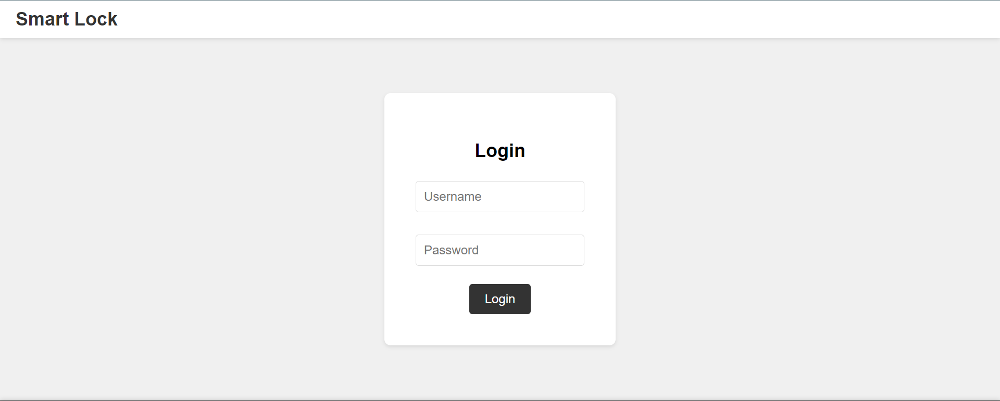
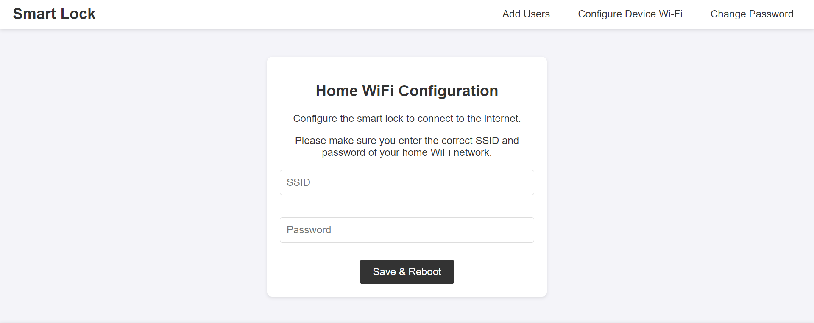
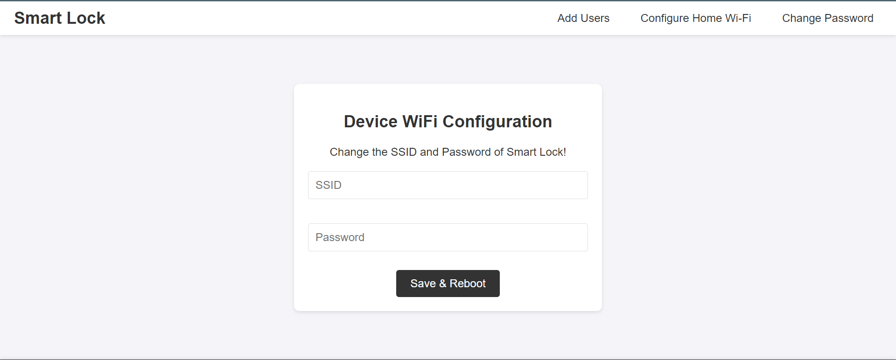
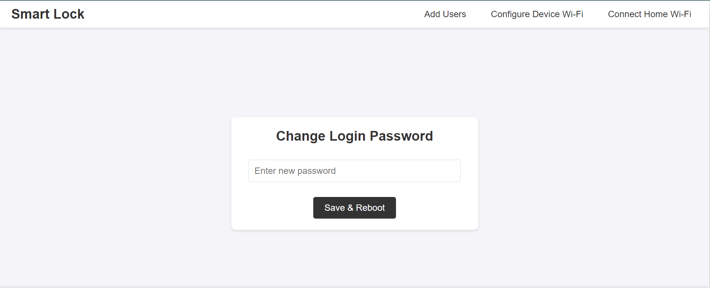
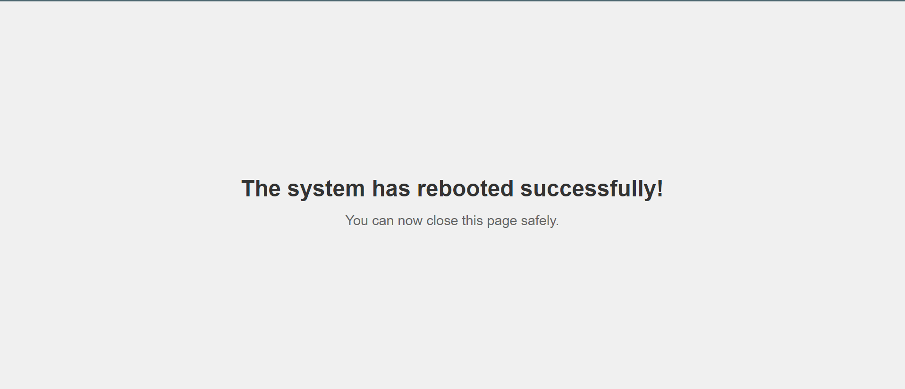

# Multi Smart Safe Locker System


A multi smart locker management system powered by ESP32, enabling secure and convenient access control for individuals, organizations, and homeowners. Users can configure and manage their lockers via a web interface, authorize access using email, and unlock lockers through the **[Smart Link](https://github.com/mediocre9/smart-link)** mobile app.

## Table of Contents

1. [Features](#1-features)
2. [Technical Features](#2-technical-features)
    - [Core System](#core-system)
    - [Authentication and Security](#authentication-and-security)
    - [Lock Management](#lock-management)
    - [System Messages](#system-responses)
3. [Setup](#3-setup)
    - [Firebase Project Setup](#firebase-project-setup)
    - [Firmware Configuration](#firmware-configuration)
    - [Uploading HTML Files](#uploading-html-files)
4. [Usage](#4-usage)
    - [Smart Link Integration](#smart-link-integration)
5. [Web Interface Previews](#5-admin-panel-web-interface-previews)
6. [Libraries](#6-libraries)

## 1. Features

- 🚀 **Remote Setup and Control**: Manage locker settings through an ESP32-hosted web interface.
- ⚙️ **Wi-Fi Configuration**: Admins provide home Wi-Fi SSID and password via the web interface.
- 🔒 **Secure User Authorization**: Grant access by registering authorized email addresses.  
- 📡 **WebSocket Notifications**: Real-time notifications before locker auto-locks.
- ☁️ **Firebase Integration for Firmware Blocking**: Integrated with Firebase for developer-level firmware restrictions and real-time monitoring.  

## 2. Technical Features

### Core System

- **Microcontroller**: ESP32 with Wi-Fi and Bluetooth capabilities.
- **Cloud Integration**: Firebase Realtime Database ensures centralized control and firmware management.

### Authentication and Security

- **Email-Based Access Control**: Only pre-authorized Gmail IDs can access the locker.

### Lock Management

- **Individualized Auto-Lock Timers**: Each user’s locker re-locks after a 20-second countdown.
- **WebSocket Notifications**: Real-time updates ensure users are informed before the locker locks.

### Web Interface

- **ESP32-Hosted Web UI**: Configure network settings, authorized users, and system preferences effortlessly.
- **Real-Time Control**: Modify Wi-Fi credentials, manage user access, and monitor system status.

### System Responses

- **Access Denied**: `Access Denied. Please contact the admin to gain access.`
- **Firmware Restrictions**: `Locker access is restricted. Contact Developers for further details.`
- **Network Connection Issues**: `Unable to connect. Please contact the admin to configure the system's network settings.`

## 3. Setup

### Firebase Project Setup

1. Create a Firebase project and obtain **Firebase Web API Key** and **Realtime Database (RTDB) URL**.
2. Add these to the [config.hpp](https://github.com/mediocre9/esp-32-smart-safe-locker/blob/main/includes/config.hpp) file:

```cpp
#define FIREBASE_WEB_API_KEY "Your Firebase API Key"
#define FIREBASE_RTDB_REFERENCE_URL "Your Firebase RTDB URL"
```

### Firmware Configuration

Set `REGISTER_ESP_ON_FIREBASE` to `true` in [config.hpp](https://github.com/mediocre9/esp-32-smart-safe-locker/blob/main/includes/config.hpp) for initial device registration. Compile and upload the firmware to the ESP32. After registration, set `REGISTER_ESP_ON_FIREBASE` back to `false`.

### Uploading HTML Files

1. Install the [arduino-littlefs-upload](https://github.com/earlephilhower/arduino-littlefs-upload) plugin.
2. Place the web interface HTML files in the **data** directory.
3. Use the plugin to upload these files to the ESP32's LittleFS.

## 4. Usage

1. Connect to the ESP32 Hotspot.
2. Access the web interface at `http://192.168.4.1`.
3. Log in and configure the system.
4. Enter Wi-Fi credentials.
5. Add authorized users' emails.

### Smart Link Integration

1. Download the [Smart Link](https://github.com/mediocre9/smart-link) mobile app.
2. Sign in with a Google account.
3. Admins must add the same Google account email to the ESP32 for authorization.

_Users must authenticate with a fingerprint before sending an unlock request. The fingerprint verification serves only as a guard wall and is not processed or stored._

## 5. Admin Panel Web Interface Previews







## 6. Libraries
- LittleFS
- [Firebase_ESP_Client](https://github.com/mobizt/Firebase-ESP-Client)
- [ESPAsyncWebServer](https://github.com/me-no-dev/ESPAsyncWebServer)
- [UUID](https://github.com/RobTillaart/UUID)
- [arduino-littlefs-upload](https://github.com/earlephilhower/arduino-littlefs-upload)
- [CustomJWT](https://github.com/Ant2000/CustomJWT)
